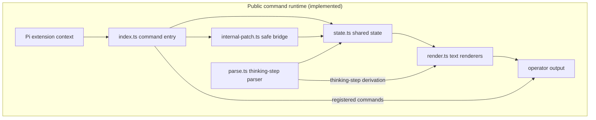
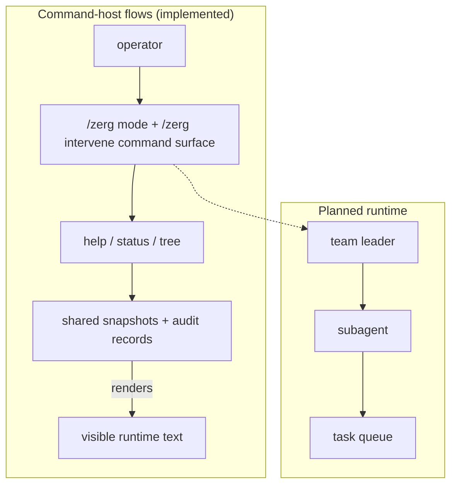

# pi-zerg-swarm

`pi-zerg-swarm` is a Pi coding-agent extension scaffold for high-capacity agentic coding teams and subagents. It is **not** a Raspberry Pi hardware swarm project.


> **v1.0.2 patch release status**
> The stable release includes the interactive TUI management product and the full command-host control, permission, lifecycle, log, and run surfaces from the RC path.
> Runtime capability remains bounded: `/zerg config` provides the interactive management TUI; operator messages use honest local/intervention status while delivered chat transport remains future scope.

## Release status

- Current release: **v1.0.2** (patch release with package/runtime version alignment, Claude Code-style runtime agent/team/model configuration, and the interactive TUI management overlay).
- Historical milestones preserved for audit traceability: v0.8.0 implementation milestone and v0.8.1 audit follow-up patch.
- Mandatory RC audits for the release path: `prompts/audit/generalized-deep-audit_v2-0-0.md`, `prompts/audit/milestone-audit_v2-0-0.md`, `prompts/audit/security-audit_v2-0-0.md`, `prompts/audit/performance-audit_v2-0-0.md`, `prompts/audit/hardening-sweep_v2-0-0.md`, and `prompts/audit/themed-cleanup_v2-0-0.md`.
- Canonical repository metadata is configured for the public repo: https://github.com/fluxgear/pi-zerg-swarm.

## Commands

- `/zerg` — canonical command
- `/zerg-swarm` — alias
- `/swarm` — alias

At v1.0.2 these commands display help, status, expanded tree visibility, deterministic thinking-step parser output, Claude Code-style runtime agent-definition configuration, adapter-backed run listing, task-first subagent spawn state, explicit fresh/fork launch-mode metadata, command-host permission queue state, fine-grained lifecycle substate hints, bounded structured log/output inspection, and a componentized Pi-native interactive management TUI for live tree/detail/settings/chat/footer management views through snapshot-safe shared-state-backed Pi command handlers.
Command-host control grammar is available via `/zerg mode status|manual|assisted|automatic|revert [reason]`, `/zerg intervene agent|subagent|leader ...`, `/zerg agents list|show|create|update|delete` with per-agent `--model`, `--fallback-models`, `--max-turns`, tools, and permission settings, `/zerg agent`/`/zerg team` lifecycle configuration flags for team leaders/members/model metadata, `/zerg runs list|show <run-id>`, `/zerg permission status|list|request|approve|deny|cancel`, `/zerg logs status|list|show|json`, `/zerg config`, and `/zerg run <agent> <task> [--bg] [--fresh|--fork] [--model <model>]`; delivered chat/process-transport wiring is still out of scope, with operator messages recorded as local/unavailable or intervention-recorded only.

## Architecture





Future milestones keep runtime, hooks, tasks, and rendering separate so monitoring can evolve without coupling to private Pi internals.

## Package shape

The package advertises a Pi extension entry in `package.json`:

```json
{
  "pi": {
    "extensions": ["./index.ts"]
  }
}
```

The TypeScript modules are intentionally small:

- `types.ts` — shared contracts and structural Pi context types
- `state.ts` — deterministic state helpers
- `parse.ts` — pure thinking-step derivation
- `render.ts` — width-aware text rendering
- `internal-patch.ts` — no-op-safe internal bridge scaffold
- `index.ts` — extension registration and command handling

## Development

```sh
npm install
npm run build
npm test
npm run check:package
npm run check:version
```
`npm run build` performs strict TypeScript no-emit checking. `npm test` runs parser plus command-surface coverage, state/container behavior, registration snapshot semantics, internal-patch event-bus wrapping/duplicate/rollback/dispose paths, render/lifecycle/mode/permission/log regressions, and focused M9 UI coverage for management overlay lifecycle, tree navigation, settings/actions, chat delivery semantics, and fake-Pi shared-state parity checks using Node's built-in test runner and `tsx`.
`npm run check:package` validates MIT/license metadata, package/build private-path guards, package-lock↔package version sync, and repository metadata fields for release discoverability and consistency.
`npm run check:version` confirms that the package release tag `v1.0.2` is at `HEAD` in post-tag state. During explicit pre-tag release prep, skip this check until the `v1.0.2` tag exists at `HEAD`; if run earlier, the failure is expected.

## Roadmap

- v0.1.0: command surface hardening (completed)
- v0.2.0: richer types and state (completed)
- v0.3.0: baseline thinking-step parser hardening and Pi command integration (completed)
- v0.4.0: Pi internal bridge validation and safe event-bus observation (completed)
- v0.4.1: audit bugfix and release-hygiene version-surface consistency (completed)
- v0.5.0: render and tree visibility expansion with explicit tree, fallback hierarchy, safety markers, and truncation bounds (completed)
- v0.5.1: audit bugfix patch for fallback childIds hierarchy, explicit missing-child markers, and durable render regressions (completed)
- v0.6.1: subagent runtime lifecycle and monitoring/status/tree command surfaces (completed)
- v0.7.0: command-host mode/intervention controls with audited global state transitions and bounded intervention records (completed)
- v0.7.1: audit bugfix patch for read-only `/zerg mode status`, mode-revert `contextId` clearing, and invalid/control-only/overlong mode reason regression coverage (completed)
- v0.8.0: package readiness and config hardening (completed implementation milestone)
- v0.8.1: audit bugfix patch for release-surface/version-alignment follow-ups (completed milestone)
- v0.9.0: release-prep/doc and package-readiness polish (completed)
- v0.9.1: publication/public repository readiness and check:version doc polish (completed)
- v1.0.0-rc.3: release-candidate agent-definition registry and metadata finalization (completed)
- v1.0.0-rc.4: release-candidate adapter read APIs and run inspection surfaces (completed)
- v1.0.0-rc.5: release-candidate task-first spawn and task/run identity surfaces (completed)
- v1.0.0-rc.6: release-candidate fresh/fork launch modes and run metadata surfaces (completed)
- v1.0.0-rc.7: release-candidate command-host permission queue and approval audit surfaces (completed)
- v1.0.0-rc.8: release-candidate fine-grained lifecycle substates for agents, teams, tasks, runs, and permission waits (completed)
- v1.0.0-rc.9: release-candidate structured output and bounded logs for runs, permissions, lifecycle events, and management views (completed)
- v1.0.0-rc.10: release-candidate full management overlay for monitor, control, targets, permissions, lifecycle, logs, intervention, and config views (completed)
- v1.0.0-rc.11: release-candidate interactive TUI management product with live tree/detail/settings/chat/footer surfaces (completed)
- v1.0.0: stable release with Pi-native interactive management TUI alignment (completed)
- v1.0.1: patch release with Claude Code-style runtime agent/team/model configuration (completed)
- v1.0.2: patch release with package/runtime version alignment (current release)
- post-v1.0.2: delivered chat/process transport and external transport validation

## License

MIT © pi-zerg-swarm contributors
