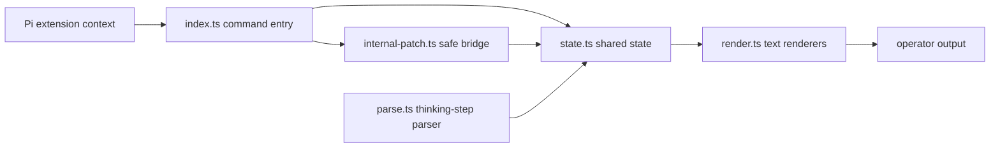
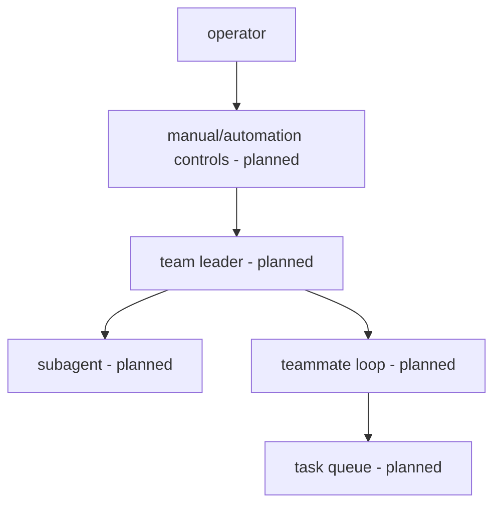

# pi-zerg-swarm

`pi-zerg-swarm` is a Pi coding-agent extension scaffold for high-capacity agentic coding teams and subagents. It is **not** a Raspberry Pi hardware swarm project.

> v0.1.0 status: command-surface milestone. Slash-free Pi command registration, `/zerg` aliases, scaffold help/status/tree output, baseline thinking-step parsing, and text renderers are present; real subagent spawning, team loops, task queues, live overlays, and intervention controls are planned but not implemented yet.

## Commands

- `/zerg` — canonical command
- `/zerg-swarm` — alias
- `/swarm` — alias

At v0.1.0 these commands display scaffold help, status, tree, or thinking-step parser output through Pi command handlers.

## Architecture



Future milestones keep runtime, hooks, tasks, and rendering separate so monitoring can evolve without coupling to private Pi internals.



## Package shape

The package advertises a Pi extension entry in `package.json`:

```json
{
  "pi": {
    "extensions": ["./index.ts"]
  }
}
```

The TypeScript modules are intentionally small:

- `types.ts` — shared contracts and structural Pi context types
- `state.ts` — deterministic state helpers
- `parse.ts` — pure thinking-step derivation
- `render.ts` — width-aware text rendering
- `internal-patch.ts` — no-op-safe internal bridge scaffold
- `index.ts` — extension registration and command handling

## Development

```sh
npm install
npm run build
npm test
```

`npm run build` performs strict TypeScript no-emit checking. `npm test` runs the bootstrap parser tests with Node's built-in test runner and `tsx`.

## Roadmap

- v0.1.0: command surface hardening (current milestone)
- v0.2.0: richer types and state
- v0.3.0: baseline thinking-step parser hardening and Pi command integration
- v0.4.0: Pi internal bridge validation
- v0.5.0: render and tree visibility
- v0.6.0+: subagent runtime, monitoring, intervention, and package readiness

## License

MIT © pi-zerg-swarm contributors
