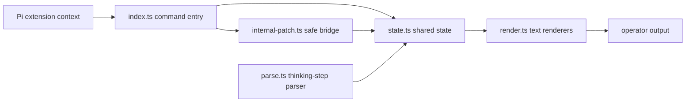

# pi-zerg-swarm

`pi-zerg-swarm` is a Pi coding-agent extension scaffold for high-capacity agentic coding teams and subagents. It is **not** a Raspberry Pi hardware swarm project.

> v0.8.0 status: package-readiness and config-hardening scope adds private-path package/build guards, repository/version metadata checks, and release scripts while preserving v0.7.1 command-host lifecycle+mode/intervention controls. Runtime and parser feature scope remains aligned. MIT licensing is unchanged; live TUI overlays, chat, and external transport validation remain planned and unvalidated.

## Commands

- `/zerg` — canonical command
- `/zerg-swarm` — alias
- `/swarm` — alias

At v0.8.0 these commands display help, status, expanded tree visibility, deterministic thinking-step parser output, and agent/team lifecycle monitoring through snapshot-safe shared-state-backed Pi command handlers. Command-host control grammar is available via `/zerg mode status|manual|assisted|automatic|revert [reason]` and `/zerg intervene agent|subagent|leader ...`; live overlay chat/process-transport wiring is still out of scope.

## Architecture



Future milestones keep runtime, hooks, tasks, and rendering separate so monitoring can evolve without coupling to private Pi internals.

```mermaid
graph TD
  Leader[team leader - planned] --> SubA[subagent - planned]
  Leader --> MateA[teammate loop - planned]
  MateA --> TaskA[task queue - planned]
  Operator[operator] --> Control[/zerg mode + /zerg intervene - command host]
  Control --> Leader
```

## Package shape

The package advertises a Pi extension entry in `package.json`:

```json
{
  "pi": {
    "extensions": ["./index.ts"]
  }
}
```

The TypeScript modules are intentionally small:

- `types.ts` — shared contracts and structural Pi context types
- `state.ts` — deterministic state helpers
- `parse.ts` — pure thinking-step derivation
- `render.ts` — width-aware text rendering
- `internal-patch.ts` — no-op-safe internal bridge scaffold
- `index.ts` — extension registration and command handling

## Development

```sh
npm install
npm run build
npm test
npm run check:package
npm run check:version
```

`npm run build` performs strict TypeScript no-emit checking. `npm test` runs parser plus command-surface coverage, v0.2.0 state/container behavior, registration snapshot semantics, v0.3.0 thinking-step parser coverage, internal-patch event-bus wrapping/duplicate/rollback/dispose paths, v0.4.1 release-hygiene assertions, v0.5.1 render regressions, v0.6.1 lifecycle/monitoring/shared-state coverage, v0.7.1 mode/intervention coverage, and v0.8.0 package-readiness surface consistency checks with fake-Pi shared-state parity checks using Node's built-in test runner and `tsx`.
`npm run check:package` validates MIT/license metadata, package/build private-path guards, and package-lock to package version sync for release readiness, while warning if repository metadata is not yet configured.
`npm run check:version` requires a `v0.8.0` tag at `HEAD`; until v0.8.0 is tagged this check fails by design. Canonical repository URL is not yet configured, so `check:package` currently warns until that metadata is added.

## Roadmap

- v0.1.0: command surface hardening (completed)
- v0.2.0: richer types and state (completed)
- v0.3.0: baseline thinking-step parser hardening and Pi command integration (completed)
- v0.4.0: Pi internal bridge validation and safe event-bus observation (completed)
- v0.4.1: audit bugfix and release-hygiene version-surface consistency (completed)
- v0.5.0: render and tree visibility expansion with explicit tree, fallback hierarchy, safety markers, and truncation bounds (completed)
- v0.5.1: audit bugfix patch for fallback childIds hierarchy, explicit missing-child markers, and durable render regressions (completed)
- v0.6.1: subagent runtime lifecycle and monitoring/status/tree command surfaces (completed)
- v0.7.0: command-host mode/intervention controls with audited global state transitions and bounded intervention records (completed)
- v0.7.1: audit bugfix patch for read-only `/zerg mode status`, mode-revert `contextId` clearing, and invalid/control-only/overlong mode reason regression coverage (completed)
- v0.8.0: package readiness and config hardening (current release)
- v0.8.1+: live TUI overlays and chat/external transport validation
- v1.0.0-rc.1+: package and runtime release hardening

## License

MIT © pi-zerg-swarm contributors
