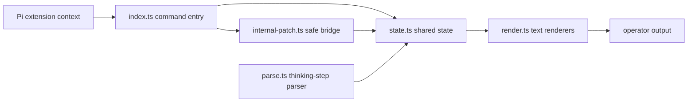
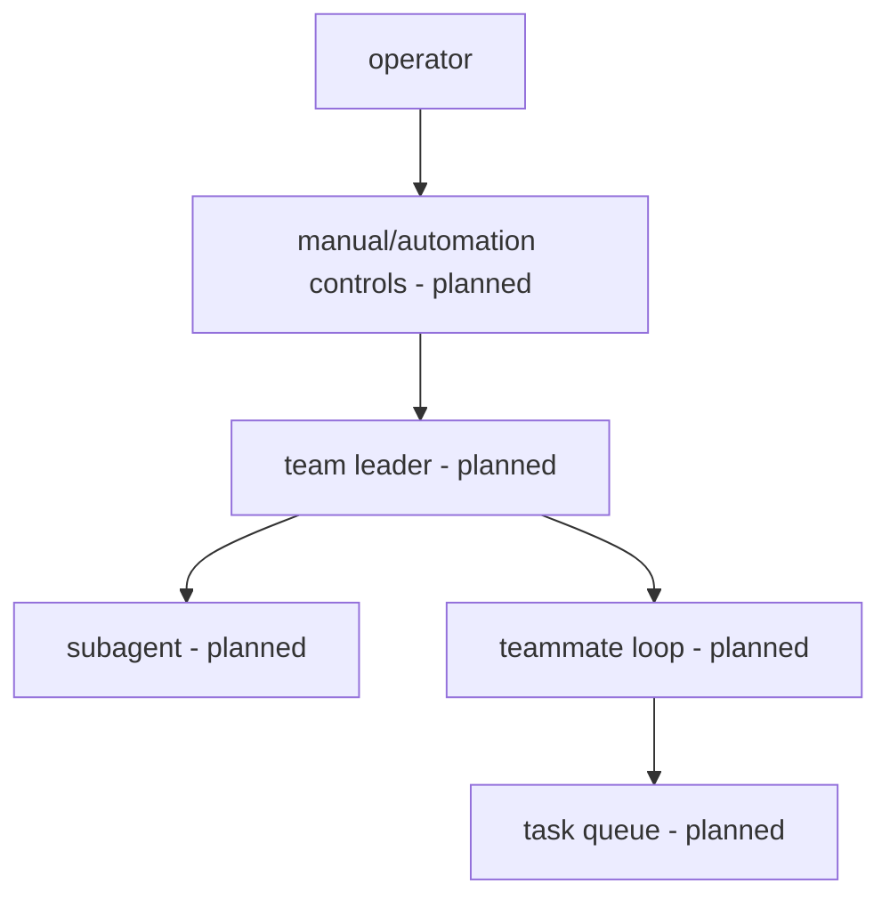

# pi-zerg-swarm

`pi-zerg-swarm` is a Pi coding-agent extension scaffold for high-capacity agentic coding teams and subagents. It is **not** a Raspberry Pi hardware swarm project.

> v0.5.1 status: audit bugfix patch on top of the v0.5.0 render/tree visibility release. Package metadata, command/status/help output, README current-release wording, changelog top entry, and tests now align on v0.5.1; slash-free Pi command registration, `/zerg` aliases, scaffold help/status/tree output, deterministic thinking-step parsing with source-line IDs, status prefixes/aliases, checkbox precedence, text renderers, deterministic state schema metadata, snapshot-safe state container APIs, team/tree helpers, registration disposal cleanup, safe Pi event-bus emit/subscription observation, duplicate patch suppression, rollback/disposal behavior, expanded tree rendering, fallback `AgentIdentity.childIds` hierarchy, explicit missing-child markers, durable render regression coverage, and bounded/truncated output are present. Manual Pi overlay verification has not been performed; real subagent spawning, team loops, task queues, live overlays, and intervention controls are planned but not implemented yet.

## Commands

- `/zerg` — canonical command
- `/zerg-swarm` — alias
- `/swarm` — alias

At v0.5.1 these commands display scaffold help, status, expanded tree visibility, or deterministic thinking-step parser output through Pi command handlers backed by snapshot-safe state helpers, and the extension safely observes Pi event-bus emit/subscription activity when an event bus is available.

## Architecture



Future milestones keep runtime, hooks, tasks, and rendering separate so monitoring can evolve without coupling to private Pi internals.



## Package shape

The package advertises a Pi extension entry in `package.json`:

```json
{
  "pi": {
    "extensions": ["./index.ts"]
  }
}
```

The TypeScript modules are intentionally small:

- `types.ts` — shared contracts and structural Pi context types
- `state.ts` — deterministic state helpers
- `parse.ts` — pure thinking-step derivation
- `render.ts` — width-aware text rendering
- `internal-patch.ts` — no-op-safe internal bridge scaffold
- `index.ts` — extension registration and command handling

## Development

```sh
npm install
npm run build
npm test
```

`npm run build` performs strict TypeScript no-emit checking. `npm test` runs the parser plus command-surface, v0.2.0 state/container, registration snapshot, v0.3.0 thinking-step parser, internal-patch event-bus wrapping/duplicate/rollback/dispose, v0.4.1 release-hygiene assertions, v0.5.1 public version-surface assertions, and render regression tests with Node's built-in test runner and `tsx`.

## Roadmap

- v0.1.0: command surface hardening (completed)
- v0.2.0: richer types and state (completed)
- v0.3.0: baseline thinking-step parser hardening and Pi command integration (completed)
- v0.4.0: Pi internal bridge validation and safe event-bus observation (completed)
- v0.4.1: audit bugfix and release-hygiene version-surface consistency (completed)
- v0.5.0: render and tree visibility expansion with explicit tree, fallback hierarchy, safety markers, and truncation bounds (completed)
- v0.5.1: audit bugfix patch for fallback childIds hierarchy, explicit missing-child markers, and durable render regressions (current release)
- v0.6.0+: subagent runtime, monitoring, intervention, and package readiness

## License

MIT © pi-zerg-swarm contributors
